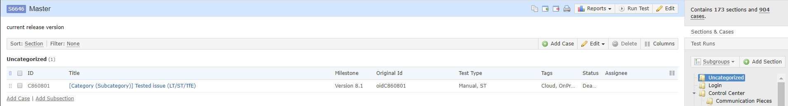
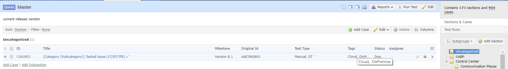

# TestRail Tooltips
This add-on injects JavaScript into TestRail web pages for adding tooltips for long values. 

Compatible with TestRail *5.4.1.3669* and lower.

Before add-on: 

After add-on:

## Release Notes
### v1.0
* bumped version

## Add-on for FireFox
[TestRail TestCasesCount v1.0](https://addons.mozilla.org/en-US/firefox/addon/testrail-tooltips/)

## Add-on for Chrome
* download file [TestRail Tooltips v1.0](https://github.com/cernyjan/TestRail-Tooltips/blob/master/testrail_tooltips-1.0-an+fx.xpi)
* extract it on the file system
* open Extensions page in browser
* click the “Developer mode” checkbox to activate it
* click the “Load unpacked extension” button
* Navigate to the extension’s directory and open it